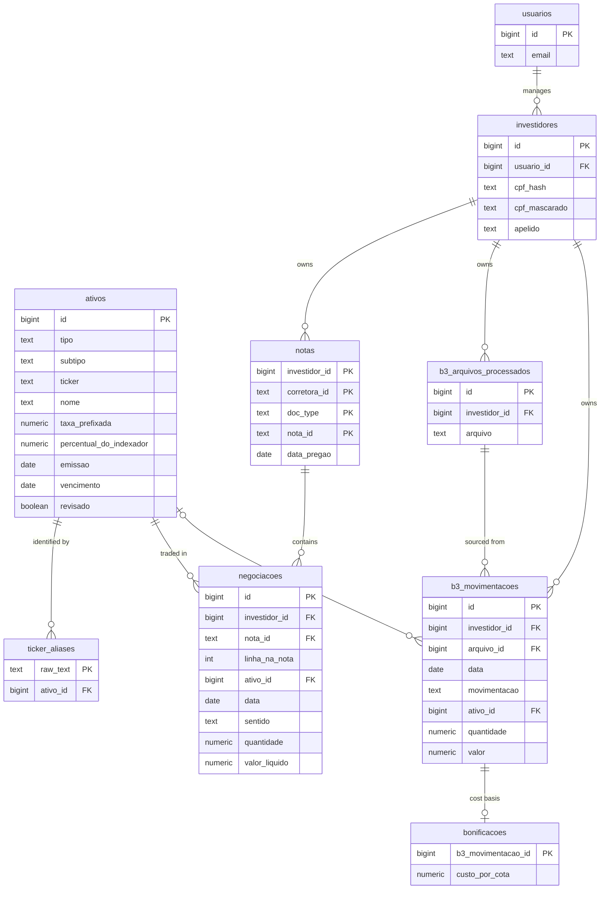

# Database Schema

PostgreSQL database for the investment portfolio system.

The source of truth is [`tabelas.py`](../tabelas.py) (SQLAlchemy Core); every change
ships as an Alembic migration in [`migrations/versions/`](../migrations/versions/).
This document explains the meaning of each table and column.

All monetary values are in **BRL** unless otherwise noted.  
Money, quantities and rates are **NUMERIC** (exact decimals).  
Dates are **DATE**; load timestamps are **TIMESTAMPTZ**.

## Tenancy

| Table | Scope |
|---|---|
| `usuarios` | An account that logs in (unique e-mail, case-insensitive) |
| `investidores` | One portfolio per CPF found on the account's notas. The CPF is never stored: only a keyed HMAC (`cpf_hash`, unique per usuario) and a masked form. See [lgpd.md](lgpd.md) |
| `notas`, `negociacoes`, `b3_arquivos_processados`, `b3_movimentacoes` | Owned by one investidor (`investidor_id`); `bonificacoes` inherits it from its movimentação |
| `ativos`, `ticker_aliases` | Shared catalog — the same instrument for every investidor |

Every portfolio query must filter by `investidor_id`.

### Row-level security

`investidores`, `notas`, `negociacoes`, `b3_arquivos_processados`, `b3_movimentacoes` and
`bonificacoes` have Postgres RLS policies (migration `0003`). Web requests run as the
restricted role `carteira_app` with `app.usuario_id` set to the logged-in account, and the
policies only expose that account's rows. `carteira_app` has no access to `usuarios` or
`sessoes`. The owner role (migrations, CLI, authentication) is not subject to the policies.

| Table | Scope |
|---|---|
| `usuarios` | Account: e-mail, Argon2id `senha_hash`, `e_admin`, login lockout counters |
| `sessoes` | Login sessions: SHA-256 of the cookie token, CSRF token, selected portfolio, expiry |

---

## Data Sources

| Table | Populated by | Source |
|---|---|---|
| `usuarios` | sign-up / `migra_sqlite.py` | One row per account |
| `investidores` | `carrega_notas.py` (from the CPF on each nota) | Auto-created on first nota of a CPF |
| `ativos` | `carrega_notas.py`, `carrega_b3.py` | Auto-created on first encounter from PDFs and B3 reports |
| `ticker_aliases` | `carrega_notas.py`, `carrega_b3.py` | Auto-created alongside `ativos` |
| `notas` | `carrega_notas.py` | One row per source PDF (all doc types) |
| `negociacoes` | `carrega_notas.py` | One row per trade line extracted from PDFs |
| `b3_movimentacoes` | `carrega_b3.py` | B3 movimentações Excel exports |
| `b3_arquivos_processados` | `carrega_b3.py` | Audit log of loaded files |
| `bonificacoes` | `carrega_b3.py`, `revisa_bonificacoes.py` | Cost basis for bonus shares |

---

## Entity Relationship



---

## `notas`

One row per source document.  
Covers all three document types: `NotaCorretagem`, `TituloPublico`, `TituloPrivado`.  
Identity data printed on the document (CPF, name, address, broker client code, advisor) is
deliberately not stored — see [lgpd.md](lgpd.md).

| Column | Type | Nullable | Source | Description |
|---|---|---|---|---|
| `investidor_id` | BIGINT PK | NO | — | FK → `investidores.id`. Resolved from the CPF printed on the nota (the CPF itself is not stored) |
| `nota_id` | TEXT PK | NO | all | Nota number as printed on the document |
| `corretora_id` | TEXT PK | NO | all | Broker identifier (`nu_invest`, `xp`, `safra`, `brasil_plural`) |
| `doc_type` | TEXT PK | NO | all | `NotaCorretagem` / `TituloPublico` / `TituloPrivado` |
| `data_pregao` | DATE | NO | all | Trade / operation date |
| `data_de_liquidacao` | DATE | YES | TituloPrivado | Settlement date; differs from `data_pregao` for fixed income |
| `folha` | TEXT | YES | NotaCorretagem | Page number within a multi-page nota |
| `nota_de` | TEXT | YES | TituloPrivado | Raw operation label from the document (e.g. `VENDA FINAL`, `RESGATE`). Source for `negociacoes.tipo` inference |
| `local` | TEXT | YES | TituloPrivado | Trading venue / platform |
| `emissor` | TEXT | YES | TituloPrivado | Issuing institution name |
| `cnpj_emissor` | TEXT | YES | TituloPrivado | CNPJ of the issuing institution |
| `comando` | TEXT | YES | TituloPrivado | Internal operation command code |
| `mercado` | TEXT | YES | TituloPublico | Market segment (e.g. `Tesouro Direto`) |
| `status` | TEXT | YES | TituloPublico | Operation status (e.g. `Pago`, `Pendente`) |
| `liquido_para` | NUMERIC | YES | all | Net amount the client pays or receives to settle this nota |
| `filename` | TEXT | NO | — | Source PDF filename |
| `processado_em` | TIMESTAMPTZ | NO | — | Timestamp of first load |
| **Resumo dos Negócios** | | | | *(NotaCorretagem only)* |
| `debentures` | NUMERIC | YES | NotaCorretagem | Debêntures volume |
| `vendas_a_vista` | NUMERIC | YES | NotaCorretagem | Total value of equity sales |
| `compras_a_vista` | NUMERIC | YES | NotaCorretagem | Total value of equity purchases |
| `opcoes_compras` | NUMERIC | YES | NotaCorretagem | Options purchases value |
| `opcoes_vendas` | NUMERIC | YES | NotaCorretagem | Options sales value |
| `operacoes_a_termo` | NUMERIC | YES | NotaCorretagem | Forward / term contracts value |
| `valor_das_operacoes_com_titulos_publicos` | NUMERIC | YES | NotaCorretagem | Tesouro Direto volume (nominal) |
| `valor_das_operacoes` | NUMERIC | YES | NotaCorretagem | Grand total of all operations |
| `valor_liquido_das_operacoes` | NUMERIC | YES | NotaCorretagem | Net value after netting buys and sells |
| **Resumo Financeiro** | | | | *(NotaCorretagem only)* |
| `taxa_de_liquidacao` | NUMERIC | YES | NotaCorretagem | B3 clearing / settlement fee |
| `taxa_de_registro` | NUMERIC | YES | NotaCorretagem | B3 registration fee |
| `total_clearing_cblc` | NUMERIC | YES | NotaCorretagem | Total CBLC/clearing charges subtotal |
| `taxa_de_termo_opcoes` | NUMERIC | YES | NotaCorretagem | Term / options fee |
| `taxa_a_n_a` | NUMERIC | YES | NotaCorretagem | ANA fee |
| `emolumentos` | NUMERIC | YES | NotaCorretagem | Exchange emoluments |
| `total_bolsa` | NUMERIC | YES | NotaCorretagem | Total exchange charges subtotal |
| `corretagem` | NUMERIC | YES | NotaCorretagem | Brokerage commission |
| `iss` | NUMERIC | YES | NotaCorretagem | ISS municipal services tax |
| `irrf_sobre_operacoes` | NUMERIC | YES | NotaCorretagem | IRRF withheld on day-trades |
| `outras` | NUMERIC | YES | NotaCorretagem | Other charges |
| `total_corretagem_despesas` | NUMERIC | YES | NotaCorretagem | Total brokerage + fees subtotal |
| `taxa_operacional` | NUMERIC | YES | NotaCorretagem (XP) | XP operational fee |
| `execucao` | NUMERIC | YES | NotaCorretagem (XP, Safra) | Execution fee |
| `taxa_de_custodia` | NUMERIC | YES | NotaCorretagem (XP) | XP custody fee |
| `impostos` | NUMERIC | YES | NotaCorretagem (XP) | XP taxes line |
| `pis_cofins` | NUMERIC | YES | NotaCorretagem (Safra) | Safra PIS/COFINS |
| `taxa_de_transferencia_de_ativos` | NUMERIC | YES | NotaCorretagem (Safra) | Safra asset transfer fee |
| `execucao_casa` | NUMERIC | YES | NotaCorretagem (Safra) | Safra in-house execution fee |

**Primary key:** `(investidor_id, corretora_id, doc_type, nota_id)` — nota numbers are only unique per broker and investidor

---

## `negociacoes`

One row per trade line.  
For `NotaCorretagem` a nota may have many rows (one per line in the *Negócios Realizados* table).  
For `TituloPublico` and `TituloPrivado` a nota always has exactly one row.

| Column | Type | Nullable | Source | Description |
|---|---|---|---|---|
| `id` | BIGINT PK | NO | — | Auto-increment surrogate key |
| `investidor_id` | BIGINT | NO | — | Part of the FK → `notas`; denormalized so every query can filter on it |
| `nota_id` | TEXT | NO | all | FK → `notas.nota_id` |
| `corretora_id` | TEXT | NO | all | FK → `notas.corretora_id` |
| `doc_type` | TEXT | NO | all | FK → `notas.doc_type` |
| `linha_na_nota` | INTEGER | NO | all | 0-based index of this line within the nota. Always `0` for single-trade documents |
| `ativo_id` | BIGINT | NO | — | FK → `ativos.id` |
| `data` | DATE | NO | all | Trade / operation date. Denormalized from `notas.data_pregao` for query convenience |
| `sentido` | TEXT | NO | all | `entrada` (buy / aquisicao) or `saida` (sell / resgate). Derived from `tipo` |
| `tipo` | TEXT | NO | all | `compra` / `venda` / `aquisicao` / `resgate`. See [negociacoes.tipo](#negociacoestipo) |
| `debito_credito` | TEXT | YES | NotaCorretagem | `D` (cash outflow) or `C` (cash inflow). Present on equity lines; `NULL` for renda fixa |
| `quantidade` | NUMERIC | YES | all | Number of shares / units / nominal amount |
| `preco_unitario` | NUMERIC | YES | all | Unit price in BRL |
| `valor_bruto` | NUMERIC | YES | all | Gross trade value (`quantidade × preco_unitario`) |
| `taxas_proporcionais` | NUMERIC | NO | all | Portion of nota-level fees allocated to this line (proportional to `valor_bruto`). Always `0` for Tesouro Direto |
| `valor_liquido` | NUMERIC | YES | all | Net amount for this trade after fees |
| `mercado` | TEXT | YES | NotaCorretagem | Market segment code (e.g. `BOVESPA`, `BMF`) |
| `tipo_de_mercado` | TEXT | YES | NotaCorretagem | Market type (e.g. `VISTA`, `OPCAO DE COMPRA`) |
| `prazo` | TEXT | YES | NotaCorretagem, TituloPrivado | Expiry or term |
| `observacao` | TEXT | YES | NotaCorretagem | Free-text note from the broker (e.g. `#` for day-trade) |
| `indexador` | TEXT | YES | TituloPrivado | Rate index (e.g. `CDI`, `IPCA`, `PRÉ`) |
| `taxa_cupom_percentual` | NUMERIC | YES | TituloPrivado | Coupon rate in percent |
| `percentual_do_indexador` | NUMERIC | YES | TituloPrivado | Percentage of the index (e.g. `109.5` for 109.5% CDI) |
| `emissao` | DATE | YES | TituloPrivado | Instrument issuance date |
| `vencimento` | DATE | YES | TituloPrivado | Instrument maturity date |
| `custodia` | TEXT | YES | TituloPrivado | Custodian name |
| `tipo_emitente` | TEXT | YES | TituloPrivado | Issuer category (e.g. `Banco`) |
| `conta_bancaria` | TEXT | YES | TituloPrivado | Bank account tied to the operation |
| `rendimentos` | TEXT | YES | TituloPrivado | Accrued interest description |
| `imposto_de_renda_federal` | NUMERIC | YES | TituloPrivado | IR withheld on this operation |
| `iof` | NUMERIC | YES | TituloPrivado | IOF withheld on this operation |
| `tx_bvmf` | NUMERIC | YES | TituloPublico | B3/BVMF transaction fee |
| `tx_agente_custodia` | NUMERIC | YES | TituloPublico | Custody agent fee (percentage) |
| `especificacao_observacao` | TEXT | YES | TituloPrivado | Additional specification or observation from the document |

**Unique constraint:** `(investidor_id, corretora_id, doc_type, nota_id, linha_na_nota)`  
**Checks:** `sentido IN ('entrada', 'saida')`, `quantidade >= 0`

---

## `ativos`

One row per unique investable instrument.  
Rows are created automatically on first encounter; most type-specific fields require manual review (`revisado = true` signals the row has been verified).  
The catalog is shared by all investidores, so editing it is an administrative action.

| Column | Type | Nullable | Auto? | Description |
|---|---|---|---|---|
| `id` | BIGINT PK | NO | yes | Auto-increment surrogate key |
| `tipo` | TEXT | NO | yes | Asset class: `acao` / `fii` / `bdr` / `tesouro_direto` / `renda_fixa`. Inferred from ticker pattern or doc_type |
| `subtipo` | TEXT | YES | **manual** | Instrument category. For `renda_fixa`: `CDB` / `LCI` / `LCA` / `debenture` / `CRI` / `CRA`. For `tesouro_direto`: `LTN` / `NTN-B` / `NTN-F` / `LFT`. `NULL` for equity |
| `ticker` | TEXT | YES (UNIQUE) | yes | Canonical ticker symbol. Populated for `acao`, `fii`, `bdr`. Always `NULL` for fixed income |
| `nome` | TEXT | YES | partial | Human-readable name. For fixed income: copied from `titulo` on first load. For equity: `NULL` until set manually |
| `cnpj_emissor` | TEXT | YES | yes (renda_fixa) | Issuer CNPJ. Auto-populated from `TituloPrivado` |
| `emissor` | TEXT | YES | yes (renda_fixa) | Issuer institution name. Auto-populated from `TituloPrivado.emissor` |
| `indexador` | TEXT | YES | yes (renda_fixa) | Rate benchmark: `PRÉ` / `CDI` / `IPCA` / `SELIC` / `IGPM` |
| `taxa_prefixada` | NUMERIC | YES | yes (renda_fixa) | Fixed or spread component in % p.a. |
| `percentual_do_indexador` | NUMERIC | YES | yes (renda_fixa) | Floating component as % of index (e.g. `109.5` for 109.5% CDI) |
| `emissao` | DATE | YES | yes (renda_fixa) | Issuance date |
| `vencimento` | DATE | YES | yes (renda_fixa) | Maturity date |
| `revisado` | BOOLEAN | NO | — | `false` = auto-created, not yet reviewed. `true` = manually verified |

### Column applicability by type

| Column | acao / fii / bdr | tesouro_direto | renda_fixa |
|---|---|---|---|
| `ticker` | ✓ auto | ✗ | ✗ |
| `nome` | manual | auto | auto |
| `subtipo` | ✗ | manual | manual |
| `cnpj_emissor` | manual | ✗ | ✓ auto |
| `emissor` | ✗ | ✗ | ✓ auto |
| `indexador` | ✗ | manual | ✓ auto |
| `taxa_prefixada` | ✗ | manual | auto if `PRÉ` or `IPCA+` |
| `percentual_do_indexador` | ✗ | ✗ | auto if floating |
| `emissao` | ✗ | ✗ | ✓ auto |
| `vencimento` | ✗ | manual | ✓ auto |

**Primary key:** `id`

---

## `b3_movimentacoes`

One row per line in a B3 movimentações Excel report.  
Covers all event categories B3 reports in a single table: trades, income, corporate actions, and transfers.

| Column | Type | Nullable | Description |
|---|---|---|---|
| `id` | BIGINT PK | NO | Auto-increment surrogate key |
| `investidor_id` | BIGINT | NO | FK → `investidores.id`. B3 reports carry no CPF, so it is chosen at import |
| `arquivo_id` | BIGINT | NO | FK → `b3_arquivos_processados.id`. Source file for traceability |
| `sentido` | TEXT | NO | Cash flow direction as reported by B3: `Credito` or `Debito` |
| `data` | DATE | NO | Event date |
| `movimentacao` | TEXT | NO | Event type label from B3 (e.g. `Dividendo`, `Compra`, `Atualização`) |
| `produto_raw` | TEXT | NO | Raw product string from the B3 file (e.g. `PETR4 - PETROLEO BRASILEIRO S.A. PETROBRAS`). Kept as audit trail |
| `ativo_id` | BIGINT | YES | FK → `ativos.id`. `NULL` when the product cannot be resolved |
| `instituicao` | TEXT | YES | Broker / institution name as reported by B3 |
| `quantidade` | NUMERIC | YES | Number of shares or units. `NULL` for income events that carry only a total value |
| `preco_unitario` | NUMERIC | YES | Unit price in BRL. `NULL` for income and corporate action events |
| `valor` | NUMERIC | YES | Total event value in BRL |

**Notes**
- `Atualização` rows are **position snapshots**, not deltas. `quantidade` is the total holding at that point in time. Use the most recent per `(ativo_id, instituicao)` to derive current positions.
- Trade rows (`Transferência - Liquidação`, `COMPRA / VENDA`, `Compra`) correspond to broker notes — the same trade also appears in `negociacoes` with full cost-basis detail.
- Deduplication is **date-based per investidor**: rows are skipped if any row for that `(investidor_id, data)` already exists. B3 reports are final for every date they cover (they lag ~2 days and are never amended), so this safely loads overlapping files without a row-level key, which the B3 export does not provide.

**Primary key:** `id`

---

## `b3_arquivos_processados`

Audit log of B3 Excel files that have been processed. One row per file.  
Used for traceability only — the actual deduplication guard is date-based (see `b3_movimentacoes` notes above).

| Column | Type | Nullable | Description |
|---|---|---|---|
| `id` | BIGINT PK | NO | Auto-increment surrogate key |
| `investidor_id` | BIGINT | NO | FK → `investidores.id` |
| `arquivo` | TEXT | NO | Source filename (e.g. `movimentacao-2026-05-25-18-05-35.xlsx`) |
| `processado_em` | TIMESTAMPTZ | NO | Timestamp of load |

**Primary key:** `id`  
**Unique constraint:** `(investidor_id, arquivo)`

---

## `bonificacoes`

Cost basis for bonus shares (*Bonificação em Ativos*). B3 records the event but not
the cost the company declares for the new shares; the user supplies it.

| Column | Type | Nullable | Description |
|---|---|---|---|
| `b3_movimentacao_id` | BIGINT PK | NO | FK → `b3_movimentacoes.id` (cascade delete) |
| `custo_por_cota` | NUMERIC | YES | Declared cost per share. `NULL` until informed; must be `>= 0` |

---

## `ticker_aliases`

Loader-time lookup table. Maps every raw asset description found in a PDF or B3 report to a canonical `ativo`, preventing duplicate rows from being created across multiple loads.

| Column | Type | Nullable | Description |
|---|---|---|---|
| `raw_text` | TEXT PK | NO | Exact string as extracted from the source document |
| `ativo_id` | BIGINT | NO | FK → `ativos.id` |

**Notes**
- The same ativo can have many aliases (ex-dividend suffixes, different broker formatting, B3 long-name format, etc.).
- New raw strings are appended automatically at load time. Users can re-point an alias to a different `ativo_id` to merge mistaken duplicates; `negociacoes.ativo_id` should be updated accordingly.
- **Never delete an alias row** — it is the idempotency key for the loader.

---

## Enumerations

### `ativos.tipo`

| Value | Meaning |
|---|---|
| `acao` | Brazilian equity (Bovespa, including ON and PN shares) |
| `fii` | Fundo de Investimento Imobiliário — REIT equivalent |
| `bdr` | Brazilian Depositary Receipt (foreign company listed on B3) |
| `renda_fixa` | Fixed income instrument (CDB, LCI, LCA, Debenture, etc.) |
| `tesouro_direto` | Brazilian government bond (Tesouro Direto program) |
| `recibo_subscricao` | Subscription receipt — interim certificate between rights exercise and share delivery; eventually converts to the underlying `acao` or `fii` |
| `direito_subscricao` | Subscription right — temporary instrument that is exercised, sold, or expires |
| `desconhecido` | Type could not be inferred automatically; requires manual review |

**Inference rules** (applied automatically at load time):
- `doc_type = TituloPublico` → `tesouro_direto`
- `doc_type = TituloPrivado` → `renda_fixa`
- Canonical ticker ends in `11` → `fii`
- Canonical ticker ends in `12` → `recibo_subscricao`
- Canonical ticker ends in `3[1-9]` (e.g. `34`, `32`) → `bdr`
- Canonical ticker ends in `1`, `2`, or `9` → `direito_subscricao`
- Otherwise → `acao`

---

### `negociacoes.tipo`

| Value | `doc_type` context | Meaning |
|---|---|---|
| `compra` | `NotaCorretagem`, `TituloPublico` | Purchase — cash outflow, asset inflow |
| `venda` | `NotaCorretagem`, `TituloPublico` | Sale — asset outflow, cash inflow |
| `aquisicao` | `TituloPrivado` | Fixed income purchase (e.g. CDB issued to investor). Also mapped from `VENDA FINAL` (Nu Invest label) |
| `resgate` | `TituloPrivado` | Fixed income redemption before or at maturity |

---

### `negociacoes.sentido`

Derived from `tipo` at load time.

| Value | When |
|---|---|
| `entrada` | `tipo` is `compra` or `aquisicao` |
| `saida` | `tipo` is `venda` or `resgate` |

---

### `doc_type`

Used in `notas.doc_type` and `negociacoes.doc_type`.

| Value | Source document |
|---|---|
| `NotaCorretagem` | Equity/FII/BDR trade confirmation note |
| `TituloPublico` | Tesouro Direto transaction note |
| `TituloPrivado` | Fixed income transaction note (CDB, LCI, LCA, etc.) |

---

### `corretora_id`

| Value | Institution |
|---|---|
| `nu_invest` | Nu Investimentos S.A. — CTVM (CNPJ 62.169.875/0001-79) |
| `xp` | XP Investimentos CCTVM S.A. (CNPJ 02.332.886/0001-04) |
| `safra` | Safra DTVM Ltda (CNPJ 01.638.542/0001-57) |
| `brasil_plural` | Brasil Plural CCTVM S/A (CNPJ 05.816.451/0001-15) |

---

### `b3_movimentacoes.sentido`

| Value | Meaning |
|---|---|
| `Credito` | Asset or cash credited to the account |
| `Debito` | Asset or cash debited from the account |

---

### `b3_movimentacoes.movimentacao`

#### Income events — `valor` is the cash amount received

| Value | Meaning |
|---|---|
| `Dividendo` | Cash dividend paid by the company |
| `Juros Sobre Capital Próprio` | JCP — interest on net equity (taxed at 15% withheld at source) |
| `Rendimento` | Monthly FII distribution |

#### Position snapshot — `quantidade` is the total holding, not a delta

| Value | Meaning |
|---|---|
| `Atualização` | Point-in-time position snapshot reported by the custodian |

#### Trade events — cross-reference with `negociacoes` for cost basis

| Value | Meaning |
|---|---|
| `Transferência - Liquidação` | Trade settlement (broker note → B3 settlement) |
| `COMPRA / VENDA` | Combined buy/sell label (used by some brokers) |
| `Compra` | Purchase |

#### Fixed income events

| Value | Meaning |
|---|---|
| `Resgate` | Early or scheduled redemption of a fixed income instrument |
| `VENCIMENTO` | Maturity — instrument reached its scheduled end date |

#### Corporate action events

| Value | Meaning |
|---|---|
| `Bonificação em Ativos` | Stock bonus — new shares issued from retained earnings |
| `Fração em Ativos` | Fractional shares resulting from a corporate action |
| `Leilão de Fração` | Auction of fractional shares; generates a small cash credit |

#### Subscription events

| Value | Meaning |
|---|---|
| `Direito de Subscrição` | Subscription rights granted to existing shareholders |
| `Direitos de Subscrição - Exercido` | Rights were exercised (becomes `Recibo de Subscrição`) |
| `Direitos de Subscrição - Não Exercido` | Rights expired unexercised |
| `Direito Sobras de Subscrição` | Excess subscription rights |
| `Direito Sobras de Subscrição - Não Exercido` | Excess rights expired |
| `Recibo de Subscrição` | Interim holding between rights exercise and new share issuance |
| `Solicitação de Subscrição` | Subscription order submitted |

---

## Key Query Patterns

### Current positions (from B3 snapshots)

```sql
-- Most recent Atualização per asset per institution
SELECT
    a.ticker,
    a.tipo,
    m.instituicao,
    m.quantidade,
    m.data AS snapshot_date
FROM b3_movimentacoes m
JOIN ativos a ON a.id = m.ativo_id
WHERE m.investidor_id = :investidor_id
  AND m.movimentacao = 'Atualização'
  AND m.data = (
      SELECT MAX(m2.data)
      FROM b3_movimentacoes m2
      WHERE m2.investidor_id = m.investidor_id
        AND m2.ativo_id = m.ativo_id
        AND m2.instituicao = m.instituicao
        AND m2.movimentacao = 'Atualização'
  )
ORDER BY a.ticker;
```

### Proventos received (dividends, JCP, FII income)

```sql
SELECT
    a.ticker,
    m.movimentacao AS tipo,
    m.data,
    m.quantidade,
    m.valor
FROM b3_movimentacoes m
JOIN ativos a ON a.id = m.ativo_id
WHERE m.investidor_id = :investidor_id
  AND m.movimentacao IN ('Dividendo', 'Juros Sobre Capital Próprio', 'Rendimento')
ORDER BY m.data DESC;
```

### Cost basis per asset (from notas)

```sql
SELECT
    a.ticker,
    n.tipo,
    SUM(n.valor_liquido) AS total_investido,
    SUM(n.taxas_proporcionais) AS total_taxas
FROM negociacoes n
JOIN ativos a ON a.id = n.ativo_id
WHERE n.investidor_id = :investidor_id
  AND n.tipo IN ('compra', 'aquisicao')
GROUP BY a.ticker, n.tipo
ORDER BY a.ticker;
```

### Assets requiring manual review

```sql
SELECT id, tipo, ticker, nome
FROM ativos
WHERE NOT revisado
ORDER BY tipo, ticker;
```

